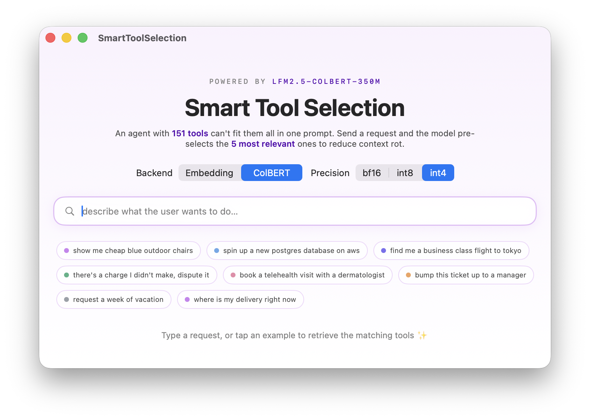
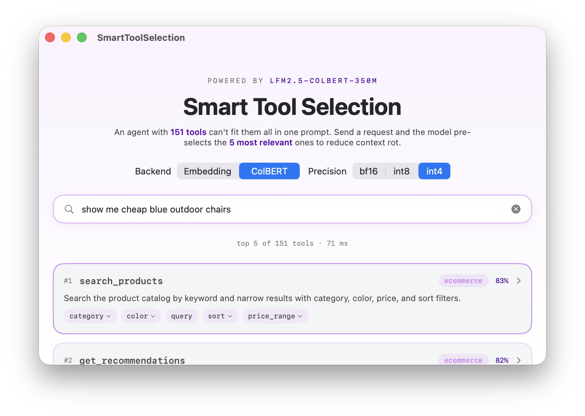

# Smart Tool Selection

A native, on-device Swift port of LiquidAI's [ColBERT Tool Selection Space](https://huggingface.co/spaces/LiquidAI/colbert-tool-selection) — the same demo, running entirely on Apple Silicon with no server.

> An agent with **151 tools** can't fit them all in one prompt. Type a request and an [LFM2.5](https://huggingface.co/LiquidAI) retriever pre-selects the **5 most relevant** tools, so you hand a small candidate set to the LLM instead of dumping every schema into the context window.

  
  &nbsp;
  

## What it does

The app indexes 151 tool definitions spanning 7 domains (e-commerce, devops, travel, support, and more). For each request it scores every tool and shows the top 5 — the candidate set you would route to an LLM instead of all 151 schemas.

Two retrievers, switchable in the UI:

- **Embedding** — `LFM2.5-Embedding-350M`: one CLS-pooled vector per tool, ranked by cosine similarity.
- **ColBERT** — `LFM2.5-ColBERT-350M`: one vector per token, ranked by MaxSim late interaction. This is the default, matching the original Space.

## How it works

Everything runs in-process on the device:

1. **Tokenize** the request (via [swift-transformers](https://github.com/huggingface/swift-transformers)).
2. **Encode** the query and each tool's routing text with LFM2.5 — the encoder forward runs on the **Apple Silicon GPU through [MLX-Swift](https://github.com/ml-explore/mlx-swift)**, using [mlx-swift-lm](https://github.com/PicoMLX/mlx-swift-lm)'s `MLXEmbedders` (which gained native LFM2.5 bidirectional-encoder support for this app).
3. **Score** on the CPU with **[Accelerate](https://developer.apple.com/documentation/accelerate)** — a single BLAS call per query over flat, L2-normalized vectors: `cblas_sgemv` for embedding cosine, `cblas_sgemm` + `vDSP_maxv` for ColBERT MaxSim.
4. **Rank** and show the top 5.

The tool index is built once when a model loads; each keystroke only re-encodes the query, so a search takes tens of milliseconds (the per-query latency is shown in the UI).

## Models & quantization

Models are downloaded from the [Hugging Face Hub](https://huggingface.co/mlx-community) on first run and cached locally; a **Precision** toggle picks the on-device weights. The bf16 checkpoints are ~680–690 MB each. We ran a quant-aware retrieval eval to choose the quantized ship precisions:

| Retriever | Quantized | Size | NDCG@10 retention vs bf16 |
|---|---|---|---|
| **Embedding-350M** | int4 | **195 MB** (3.5× smaller) | **100.0%** |
| **ColBERT-350M** | int8 | **363 MB** (1.9× smaller) | **100.0%** |
| ColBERT-350M | int4 | ~195 MB (3.5× smaller) | 98.7% |

Retention is NDCG@10 against the bf16 baseline, measured over **NanoBEIR** (English) plus **MIRACL** dev judged pools (Spanish / German / Japanese / Arabic).

- **Embedding tolerates int4 losslessly** — CLS pooling averages out quantization noise, so int4 is the recommended precision (3.5× smaller, no measurable retrieval loss, even on Japanese and Arabic).
- **ColBERT's per-token MaxSim is more quant-sensitive** — int8 is lossless and the safe default; int4 retains 98.7% (loss concentrated in English NQ, ~95%) and is the aggressive option when size-bound.

> A useful gotcha from the eval: raw embedding cosine drifts more under int4 (~0.96 vs bf16), but rank metrics ignore those small magnitude shifts — which is why retrieval stays ~lossless. Always measure quantization impact on the task metric (retrieval), not on vector cosine.

## Requirements

- Apple Silicon Mac (macOS 14+) or an iOS 17+ device
- Xcode 16+

## Build & run

1. Open `SmartToolSelection.xcodeproj`.
2. Select the **SmartToolSelection** scheme and run.
3. On first launch the app downloads the selected model from Hugging Face into `~/Library/Application Support/SmartToolSelection/models/` (the full path is printed to the console). Later launches load from that cache.

Pick a backend (Embedding / ColBERT) and precision (bf16 / int8 / int4) at the top of the window; switching either downloads the matching model as needed and rebuilds the index.

## Credits

- **Models** — [LiquidAI](https://huggingface.co/LiquidAI) LFM2.5-Embedding-350M and LFM2.5-ColBERT-350M, converted to MLX ([model repositories](https://huggingface.co/mlx-community)).
- **Original demo** — LiquidAI's [ColBERT Tool Selection Space](https://huggingface.co/spaces/LiquidAI/colbert-tool-selection).
- **On-device inference** — [MLX-Swift](https://github.com/ml-explore/mlx-swift) and [mlx-swift-lm](https://github.com/PicoMLX/mlx-swift-lm).
