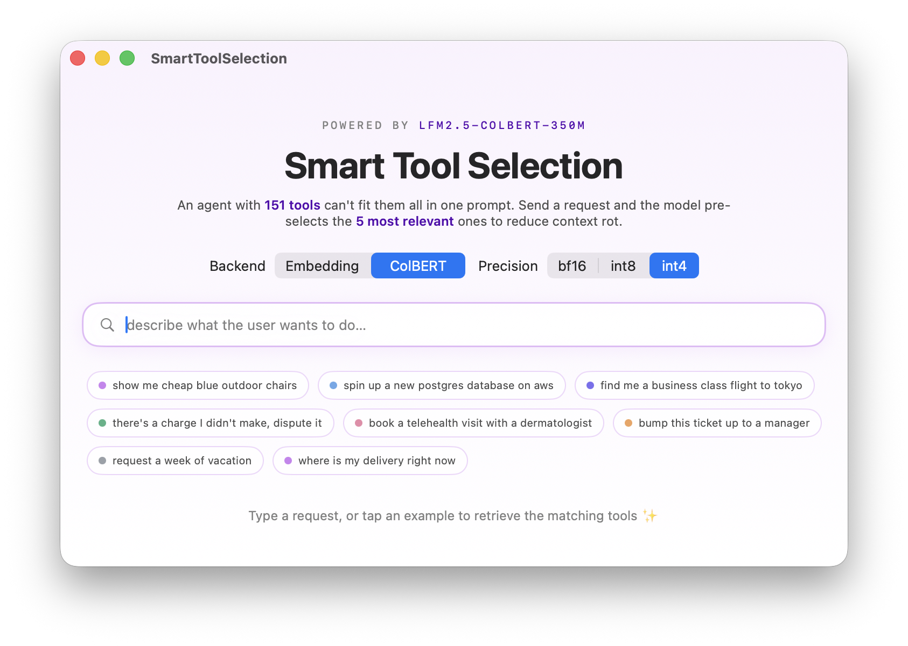
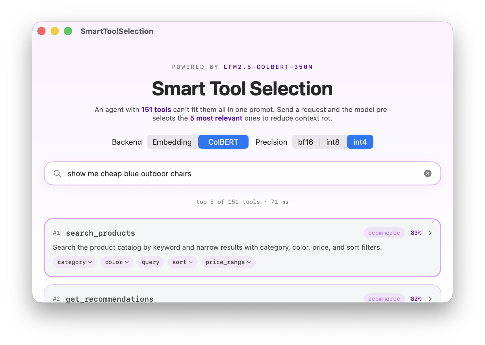

# Smart Tool Selection

A native, on-device Swift port of LiquidAI's [ColBERT Tool Selection Space](https://huggingface.co/spaces/LiquidAI/colbert-tool-selection) — the same demo, running entirely on Apple Silicon with no server.

> An agent with **151 tools** can't fit them all in one prompt. Type a request and Embedding, ColBERT, or Laya pre-selects the **5 most relevant** tools, so you hand a small candidate set to the LLM instead of dumping every schema into the context window.

<p align="center">
  
  &nbsp;
  
</p>

## What it does

The app indexes 151 tool definitions spanning 7 domains (e-commerce, devops, travel, support, and more). For each request it scores every tool and shows the top 5 — the candidate set you would route to an LLM instead of all 151 schemas.

Three backends, switchable in the UI, each scoring the full catalog:

- **Embedding** — `LFM2.5-Embedding-350M`: one CLS-pooled vector per tool, ranked by cosine similarity.
- **ColBERT** — `LFM2.5-ColBERT-350M`: one vector per token, ranked by MaxSim late interaction. This is the default, matching the original Space.
- **Laya** — the multilingual decision model through [PicoDecisions](https://github.com/PicoMLX/PicoDecisions): grouped multiple-choice questions narrow the full catalog to a shared final ranking. A Boolean mode retains the independent relevance baseline for comparison.

All three return the same top-five tool cards for a downstream LLM to choose from. The demo does not generate arguments or execute tools. Laya scores all 151 tools directly, without an embedding or ColBERT shortlist.

## How it works

Everything runs in-process on the device:

1. **Load** the selected backend. Switching backends releases the previous model and index before loading its replacement.
2. **Score** the catalog. Embedding and ColBERT index each tool's routing text (name, description, parameter names, enum values, and keywords), reuse that cached index, and encode the request with [MLX Swift](https://github.com/ml-explore/mlx-swift) and [MLXEmbedders](https://github.com/PicoMLX/mlx-swift-lm), and rank using [Accelerate](https://developer.apple.com/documentation/accelerate) BLAS. Laya uses the request as shared state. Multiple choice scores bounded groups of tool identifiers and full descriptions, keeps the best five per group, and repeats with the surviving identifiers until one final group can rank all finalists together. Boolean asks one relevance question per tool about its described capability (falling back to the tool name for an empty description). PicoDecisions processes questions in GPU batches of 16 in both modes.
3. **Rank** scores and show the top five. Equal scores retain catalog order. No relevance threshold or single-tool decision is applied.

Multiple-choice cards show **Choice probability**, normalized over the final candidate set and an explicit no-match option. Raw probabilities from separate groups are never merged. Eliminated tools do not re-enter the shortlist through zero-score ties. This tournament is an approximation: an early mistake can remove a useful candidate, and the final probability does not measure independent tool relevance or recall over the original catalog.

Boolean cards show **Relevance**, the probability the tool is useful, and **Confidence**, certainty in either relevance or irrelevance (`max(p, 1 - p)`). Only relevance controls Boolean ranking. Neither mode provides a calibrated accuracy guarantee, and scores from different backends or choice candidate sets are not directly comparable.

The displayed search latency covers completed scoring and result conversion, including every choice round, excluding model loading and queued GPU waiting. Laya evaluates every tool in its first round for each request; its full-catalog timing is not comparable to the earlier one-question routing benchmark. Editing or clearing a request and changing backend, precision, or scoring mode cancel obsolete searches; stale results are discarded.

## Models & quantization

Models are downloaded from the [Hugging Face Hub](https://huggingface.co/mlx-community) on first run and cached locally; a **Precision** toggle picks the on-device weights. The bf16 checkpoints are ~680–690 MB each. We ran a quant-aware retrieval eval to choose the quantized ship precisions:

| Retriever | Quantized | Size | NDCG@10 retention vs bf16 |
|---|---|---|---|
| **Embedding-350M** | int4 | **195 MB** (3.5× smaller) | **100.0%** |
| **ColBERT-350M** | int8 | **363 MB** (1.9× smaller) | **100.0%** |
| ColBERT-350M | int4 | ~195 MB (3.5× smaller) | 98.7% |

Retention is NDCG@10 against the bf16 baseline, measured over **NanoBEIR** (English) plus **MIRACL** dev judged pools (Spanish / German / Japanese / Arabic).

- **Embedding tolerates int4 losslessly** — CLS pooling averages out quantization noise, so int4 is the recommended precision (3.5× smaller, no measurable retrieval loss, even on Japanese and Arabic).
- **ColBERT's per-token MaxSim is more quant-sensitive** — int8 is lossless and the safe default; int4 retains 98.7% (loss concentrated in English NQ, ~95%) and is the aggressive option when size-bound.

> A useful gotcha from the eval: raw embedding cosine drifts more under int4 (~0.96 vs bf16), but rank metrics ignore those small magnitude shifts — which is why retrieval stays ~lossless. Always measure quantization impact on the task metric (retrieval), not on vector cosine.

## Requirements

- Apple Silicon Mac running macOS 26.4+, or a physical iOS 26.4+ device
- Xcode 26.6+ with Swift 6.3+; development builds also use Xcode 27

## Build & run

1. Open `SmartToolSelection.xcodeproj`.
2. Select the **SmartToolSelection** scheme and run.
3. On first launch the app downloads the selected model from Hugging Face into `~/Library/Application Support/SmartToolSelection/models/` (the full path is printed to the console). Later launches load from that cache.

Pick a backend (Embedding / ColBERT / Laya) and precision (bf16 / int8 / int4 for retrieval, FP16 / FP32 for Laya) at the top of the window; switching either downloads the matching model as needed and rebuilds the index.

The PicoDecisions dependency pins commit `7b94c97695c4592d5067d50a8bd8982a6a26536e`, which includes prompt-truncation diagnostics from [PicoDecisions PR #6](https://github.com/PicoMLX/PicoDecisions/pull/6). That PR is merged; the commit remains pinned for reproducible builds.

## Use Laya

Select **Laya** in the backend picker. FP16 is the default; FP32 is also available. The first use downloads approximately 648 MB from [convaiinnovations/laya-multilingual](https://huggingface.co/convaiinnovations/laya-multilingual) at the validated revision `052592a15d198d9ad47da779604259b10b47b7aa`. Later uses load the cached checkpoint. FP16 and FP32 use the same downloaded files, with the selected precision applied when loading.

Use **Multiple choice / Boolean** below the Laya picker to compare scoring methods. Multiple choice is the default. Switching methods reuses the loaded weights and searches the current request again.

Choice groups contain at most 20 tools plus no match. They usually contain fewer: the checkpoint reserves only 256 tokens for instructions and options. The app counts tokens using the checkpoint tokenizer during loading and sizes groups to preserve the complete descriptions. Later rounds use the surviving tool identifiers, which include domain and function name. Choice inputs that exceed the 48-token per-option limit or unexpectedly lose prompt text produce a capacity error instead of a silently shortened ranking. This demo uses a fixed catalog; supporting longer custom tool descriptions would require a different input strategy.

The cache is inside the app's Application Support directory under:

```text
SmartToolSelection/models/convaiinnovations/laya-multilingual/
  052592a15d198d9ad47da779604259b10b47b7aa/
    model.safetensors
    encoder/config.json
    rl_agent_config.json
    tokenizer/tokenizer.json
    tokenizer/tokenizer_config.json
```

The console prints the full device-specific path. Keep the nested directories intact if you inspect or copy the checkpoint.

Expand a tool card and **Prompt details** to inspect retained/original token counts. A warning appears if Boolean prompt text was shortened. Multiple choice rejects shortened prompts. Overlong request state is rejected rather than silently shortened. Search errors leave the model available to retry with another request.

## Test on a physical device

Physical-device correctness, memory, and performance still require measurement.

1. Open `SmartToolSelection.xcodeproj`, select the **SmartToolSelection** scheme, and configure the signing team for your connected device.
2. Select **Laya** and wait for its checkpoint to download and load.
3. Try an ordinary request, a negated request such as `Find my order; do not cancel it`, and a multi-tool request such as `Find a flight, book it, and add it to my calendar`. Compare the top five against Embedding and ColBERT. Missing arguments should not automatically exclude a useful capability.
4. Compare Multiple choice and Boolean. Inspect choice probabilities separately from Boolean relevance and confidence. Try unrelated and long requests, and inspect any prompt-shortening warning. Every successful search still returns five candidates, including when no match dominates or all scores are low.
5. Record full-catalog search latency, model-load time, and Xcode's process-memory gauge in FP16 and FP32. Clear or edit the request during inference and switch backends to check that obsolete results do not reappear.

The deterministic tests inject fake search and decision models and do not download weights. Set `SMART_TOOL_SELECTION_SKIP_MODEL_LOAD=1` in the scheme's Test environment, or pass `TEST_RUNNER_SMART_TOOL_SELECTION_SKIP_MODEL_LOAD=1` to `xcodebuild test`, to keep the app test host offline. Existing retrieval tests use cached model files and skip when absent. Actual inference needs Apple silicon GPU access. Opt-in full-catalog Laya smoke tests use a local checkpoint directory supplied as `SMART_TOOL_SELECTION_LAYA_MODEL` (or `TEST_RUNNER_SMART_TOOL_SELECTION_LAYA_MODEL` with `xcodebuild`). Run this suite separately from the cached retriever tests to avoid concurrent GPU execution across suites:

```sh
TEST_RUNNER_SMART_TOOL_SELECTION_SKIP_MODEL_LOAD=1 \
TEST_RUNNER_SMART_TOOL_SELECTION_LAYA_MODEL=/absolute/path/to/laya-multilingual \
xcodebuild test -project SmartToolSelection.xcodeproj -scheme SmartToolSelection \
  -destination 'platform=macOS,arch=arm64' \
  -only-testing:SmartToolSelectionTests/LayaCatalogSmokeTests \
  -parallel-testing-enabled NO
```

The smoke suite above retains the Boolean baseline. To run the paired multiple-choice/Boolean comparison, set `TEST_RUNNER_SMART_TOOL_SELECTION_LAYA_BENCHMARK` to the same local checkpoint path and select `SmartToolSelectionTests/LayaChoiceBenchmarkTests` instead. It warms both methods and alternates their order across three measured rounds for ten development requests. The test prints per-request latency, top-five IDs, round question counts, and prompt diagnostics, and writes `/tmp/smarttool-laya-choice-benchmark.json`. No weights are downloaded. Its manually listed expected tools are smoke checks, not exhaustive relevance judgments or held-out accuracy evidence.

## Development validation

The initial Boolean integration passed the macOS test suite, cached ColBERT inference checks, and an unsigned iOS device build using Xcode 27 on October 7, 2026. A separate live FP16 Laya test completed all 151 Boolean questions for each of three requests, with finite relevance/confidence values and zero truncated questions. The Debug full-catalog scoring times were 720, 835, and 821 ms on the development Mac; this three-request smoke run is not a Release latency benchmark.

The capability prompt was selected using these same development examples, not held-out data. It included `search_products` in the top five for the chair request and ranked `book_flight` first for the flight request. However, `Find my order; do not cancel it` ranked unrelated pharmacy/medical tools with probabilities above 0.99. This is a working comparison harness, not evidence that independent Laya relevance scores outperform retrieval or that high confidence establishes correctness. Representative candidate-recall and downstream tool-calling evaluation remain outstanding.

The grouped multiple-choice implementation passed 28 macOS test functions, including choice capacity/output validation, a shared final ranking, zero-probability ties, cancellation, and switching scoring methods without reloading weights. The opt-in GPU suites and uncached embedding test skip in this normal run; the cached ColBERT tests pass.

A paired FP16 Debug comparison on the Apple M5 Max used ten development requests and three timed samples per method/request, after warmup. Median completed scoring plus ranking was **331 ms for multiple choice** and **849 ms for Boolean**, approximately **2.6× faster**. The choice path used **13 first-round questions, 4 intermediate questions, and 1 final question**, with zero truncated prompts. Of eleven manually listed expected tools, the first sample for each request included eight in the choice top five and four in the Boolean top five. All three samples returned the same top-five IDs for each method/request. See [raw timings, outputs, and methodology](Docs/LayaChoiceBenchmark-2026-10-07.json).

These examples were also used while developing the prompts and grouping strategy; this is not a held-out accuracy comparison. Choice still missed shipment tracking for the negated order request, transaction disputes for the charge request, and flight search in the combined flight request. Several returned candidates were irrelevant. Later rounds use only tool identifiers, and early selection can remove useful tools. The measured latency improvement makes this a useful experiment, while quality and physical-device evaluation remain unfinished.

## Credits

- **Models** — [LiquidAI](https://huggingface.co/LiquidAI) LFM2.5-Embedding-350M and LFM2.5-ColBERT-350M, converted to MLX ([model repositories](https://huggingface.co/mlx-community)).
- **Original demo** — LiquidAI's [ColBERT Tool Selection Space](https://huggingface.co/spaces/LiquidAI/colbert-tool-selection).
- **On-device inference** — [MLX-Swift](https://github.com/ml-explore/mlx-swift) and [mlx-swift-lm](https://github.com/PicoMLX/mlx-swift-lm).
- **Laya retrieval** — [PicoDecisions](https://github.com/PicoMLX/PicoDecisions), using Convai Innovations' [multilingual Laya checkpoint](https://huggingface.co/convaiinnovations/laya-multilingual).
